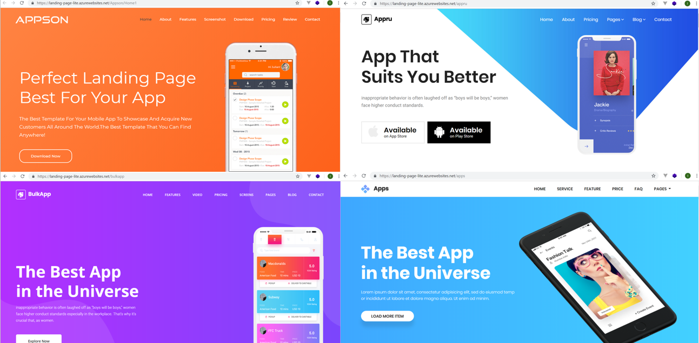
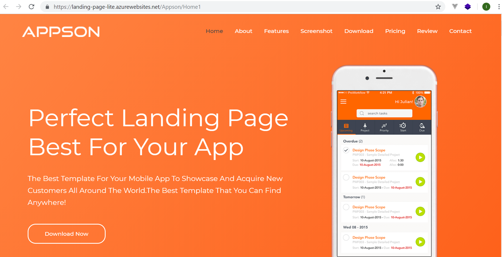
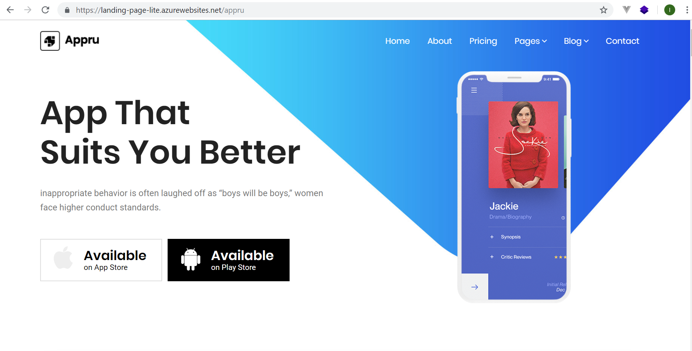
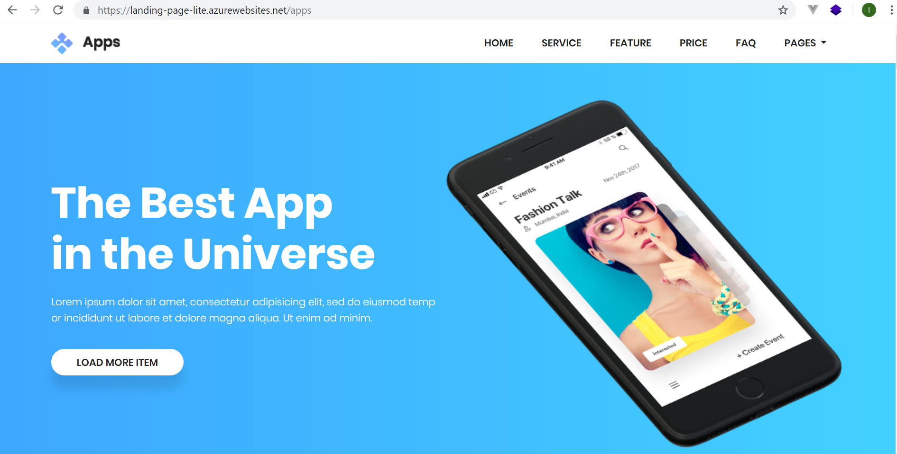
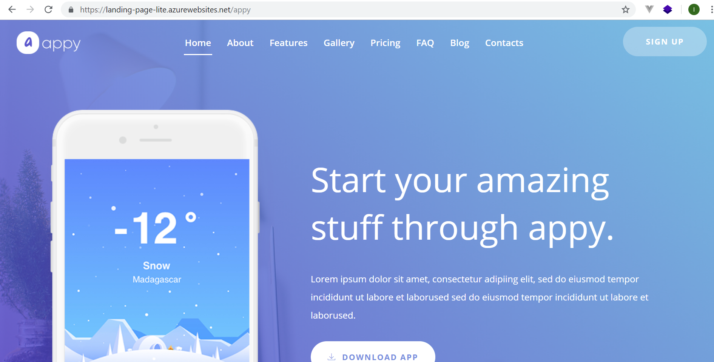
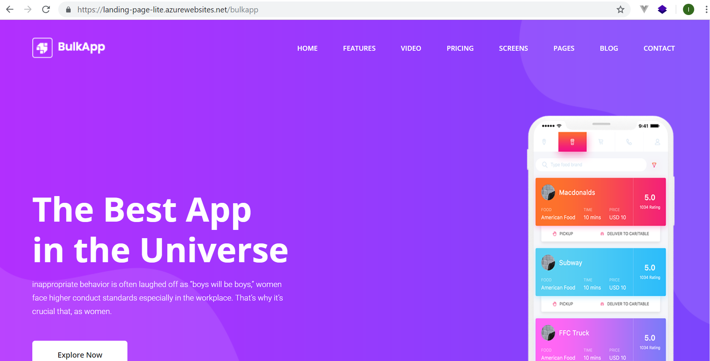
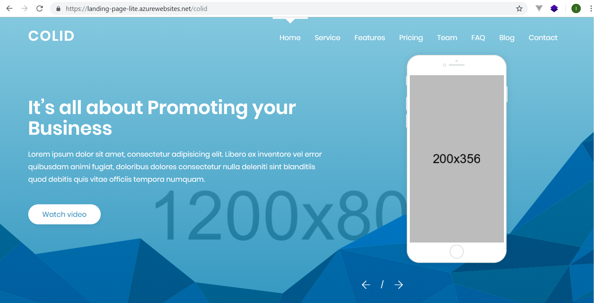
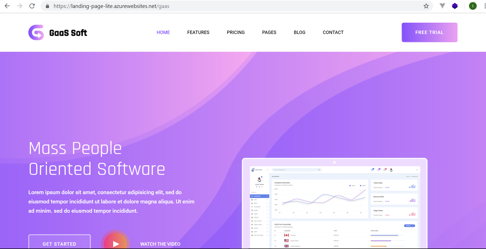

# Landing-Page-Collections

Beautiful landing page collections that will help your growth hacking effort developed using Asp.Net Core 2.2
original HTML version can be download from [Colorlib](https://colorlib.com)
support by [CodeRush.CO] source code collections (https://coderush.co)

1. experience the azure online [demo](https://landing-page-lite.azurewebsites.net/Appru)
2. experience the azure online [demo](https://landing-page-lite.azurewebsites.net/Apps)
3. experience the azure online [demo](https://landing-page-lite.azurewebsites.net/Appson)
4. experience the azure online [demo](https://landing-page-lite.azurewebsites.net/Appy)
5. experience the azure online [demo](https://landing-page-lite.azurewebsites.net/Bulkapp)
6. experience the azure online [demo](https://landing-page-lite.azurewebsites.net/Colid)
7. experience the azure online [demo](https://landing-page-lite.azurewebsites.net/Gaas)

# Development Tools & Environment

I'm using **Visual Studio Community 2017** for the development tools on Windows 10 machine.

# .Net Core Version

I'm using **.Net Core 2.2**

# Supported by CodeRush.Co
[CodeRush.CO] source code collections (https://coderush.co) lot of open source cool apps there. 50% Off All Products, Use Discount Code **GITHUB50**

